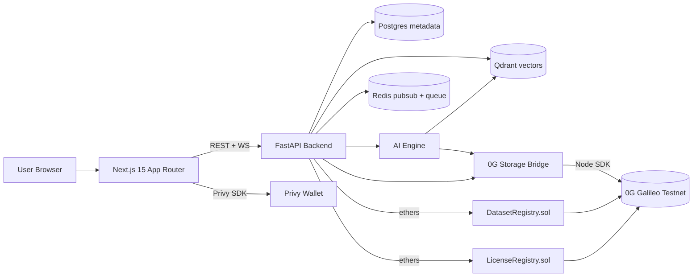

<div align="center">

# DataMind

### The decentralized economy for AI data.

DataMind turns raw files into intelligent, discoverable, reusable AI assets — stored on **0G**, owned by you, monetizable on day one.

[Architecture](docs/ARCHITECTURE.md) · [API](docs/API.md) · [0G Integration](docs/0G_INTEGRATION.md) · [Demo Flow](docs/DEMO.md)

</div>

---

## What is DataMind?

DataMind is a decentralized AI-ready dataset infrastructure platform. Users can:

- Upload datasets (CSV / JSON / TXT / PDF)
- Generate semantic embeddings (BGE-small, 384-d)
- Analyze datasets with AI (quality, topics, semantic tags, summary)
- Anchor datasets on **0G Storage** with on-chain provenance
- Launch lightweight LoRA fine-tuning jobs on TinyLlama / DistilBERT / Phi-1.5 / Qwen 0.5B
- Publish datasets to a marketplace and monetize via on-chain licensing
- Search the entire economy semantically

It transforms `Raw Files → AI-Ready Assets`.

## Architecture



See [`docs/ARCHITECTURE.md`](docs/ARCHITECTURE.md) for the full diagram, data flow, and module breakdown.

## Repository Layout

```
datamind/
  frontend/         Next.js 15 + Tailwind + shadcn + Privy + Recharts
  backend/          FastAPI + SQLAlchemy + Alembic + Qdrant + Redis pubsub WS
  ai-engine/        SentenceTransformers + LoRA (PEFT/TRL) + dataset analyzers
  smart-contracts/  Foundry — DatasetRegistry.sol + LicenseRegistry.sol
  infra/og-bridge/  Node bridge to @0glabs/0g-ts-sdk (real-mode 0G uploads)
  docker/           Per-service Dockerfiles + docker-compose.yml
  scripts/          run.sh, seed data, deploy helpers
  docs/             Architecture, API, 0G integration, demo flow
```

## Quick Start

> Mock-by-default. The full demo runs end-to-end **without** any 0G keys, Privy app, or real chain.

```bash
git clone <repo> datamind && cd datamind
cp .env.example .env

# One-shot: starts datastores via Docker, applies migrations, seeds demo data,
# launches backend + ai-engine + frontend.
./scripts/run.sh
```

Opens:

- Frontend  → http://localhost:3000
- Backend   → http://localhost:8000/docs
- AI Engine → http://localhost:8100/docs

If Docker isn't available, point `DATABASE_URL` / `QDRANT_URL` / `REDIS_URL` at hosted services and pass `--no-docker`.

### Manual setup

```bash
make install            # backend venv + ai-engine venv + frontend npm install
make migrate            # alembic upgrade head
make seed               # load Crypto Twitter Sentiment + 5 more demo datasets
make backend            # uvicorn :8000
make ai-engine          # uvicorn :8100   (in another terminal)
make frontend           # next dev :3000  (in another terminal)
```

### Smart contracts

```bash
make contracts                           # forge build && forge test -vv
make deploy-contracts                    # broadcast to Galileo testnet
# After deploy, paste DATASET_REGISTRY_ADDRESS / LICENSE_REGISTRY_ADDRESS into .env
```

## Environment

All variables live in [`.env.example`](.env.example) with comments. Highlights:

| Variable                        | Default                       | Role |
|---------------------------------|-------------------------------|------|
| `DATAMIND_OG_MOCK`              | `1`                           | When `1`, the 0G bridge returns deterministic fake hashes. Set `0` + `OG_PRIVATE_KEY` to publish to Galileo. |
| `OG_EVM_RPC`                    | `https://evmrpc-testnet.0g.ai`| EVM RPC for 0G Galileo testnet (chain id 16602). |
| `OG_INDEXER_RPC`                | turbo testnet indexer         | 0G Storage indexer URL. |
| `OG_PRIVATE_KEY`                | empty                         | Dev hot wallet — never log or commit. |
| `PRIVY_APP_ID`                  | empty                         | Leave empty for the bundled mock wallet. |
| `DATABASE_URL`                  | local Postgres                | SQLAlchemy URL (use `+asyncpg` driver). |
| `QDRANT_URL`                    | `http://localhost:6333`       | Vector DB. |
| `REDIS_URL`                     | `redis://localhost:6379/0`    | Pubsub + queue. |

## Demo Flow (8 steps)

1. **Upload** — Drag the seeded `Crypto Twitter Sentiment.csv` into `/upload`.
2. **Auto-process** — Backend extracts metadata, AI engine generates embeddings + quality score, indexes into Qdrant.
3. **Anchor** — Storage root pushed to 0G (mocked or live) and pinned in `DatasetRegistry.sol`.
4. **Marketplace** — Dataset surfaces in `/marketplace` with quality grade, AI-readiness score, owner.
5. **Search** — `/search` query `crypto sentiment trading` returns the dataset (cosine ≥ 0.78).
6. **Train** — `/training` launches a LoRA fine-tune on TinyLlama; live progress over WebSocket.
7. **Predict** — `/training/runs/<id>` shows loss curve, eval metrics, sample inference.
8. **Provenance** — `/datasets/<id>` shows tx hash, 0G storage root, license, and an on-chain receipt.

Full walkthrough in [`docs/DEMO.md`](docs/DEMO.md).

## Tech Stack

**Frontend** — Next.js 15 (App Router) · TypeScript · TailwindCSS · shadcn/ui · Framer Motion · Zustand · TanStack Query · React Hook Form · Zod · Recharts · Privy

**Backend** — Python 3.12 · FastAPI · Pydantic v2 · SQLAlchemy 2 · Alembic · arq (Celery-compatible queue) · WebSockets · slowapi rate limiting

**AI / ML** — PyTorch · HuggingFace Transformers · SentenceTransformers · PEFT · TRL · Pandas · Polars

**Data** — PostgreSQL 16 · Qdrant 1.11 · Redis 7

**Web3** — Solidity 0.8 · Foundry · ethers/web3.py · `@0glabs/0g-ts-sdk` (Node bridge)

**Infra** — Docker · Docker Compose · Vercel-ready frontend · Railway-ready backend

## Status

Hackathon MVP. See [`docs/ARCHITECTURE.md`](docs/ARCHITECTURE.md#status) for what's wired live vs. mocked.

## License

MIT — see [`LICENSE`](LICENSE).
