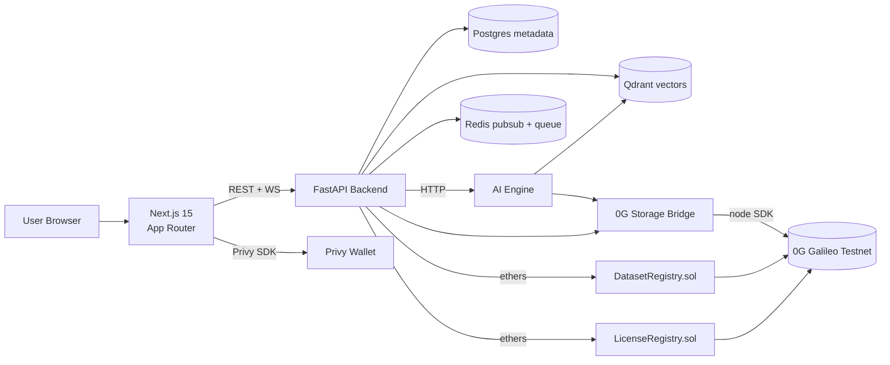
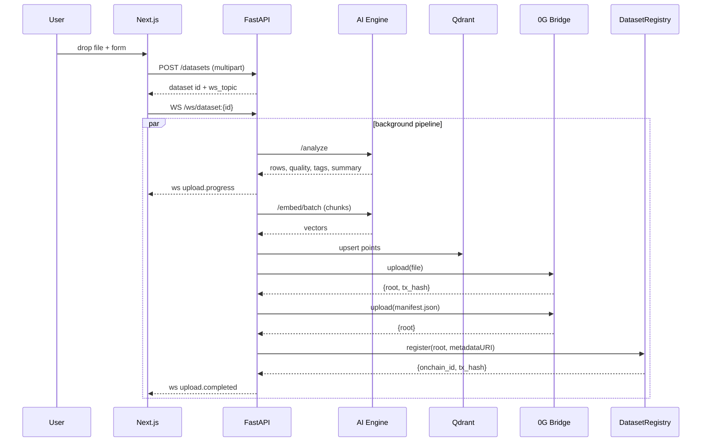

# DataMind Architecture

## High-level flow



## Repository layout

```
datamind/
  frontend/         Next.js 15 + Tailwind + shadcn + Privy + Recharts
  backend/          FastAPI + SQLAlchemy + Alembic + Qdrant + Redis pubsub WS
  ai-engine/        SentenceTransformers + LoRA (PEFT/TRL) + analyzers
  smart-contracts/  Foundry: DatasetRegistry.sol + LicenseRegistry.sol
  infra/og-bridge/  Node bridge to @0gfoundation/0g-storage-ts-sdk
  docker/           Per-service Dockerfiles + docker-compose.yml
  scripts/          run.sh, seed data
  docs/             ARCHITECTURE / API / 0G / DEMO
```

## Module breakdown

### `frontend/`
- App Router with two route groups: `(marketing)` (landing) and `(app)` (signed-in).
- Landing composed from `components/landing/*` driven by typed copy in `content/landing.ts`.
- Shared product components in `components/datamind/*` (DatasetCard, DatasetTable, QualityBadge, TrainingChart, LogStream, WalletButton, AppNav).
- `lib/api.ts` is a fetch wrapper that injects the JWT from Zustand-persisted state. `lib/queries.ts` exposes typed TanStack Query hooks.
- `hooks/useLiveTopic.ts` is a reconnecting WebSocket hook that drives upload + training progress.

### `backend/app/`
- `api/v1` — REST routers for auth, datasets, marketplace, embeddings, search, training, storage. WS at `/ws/{topic}`.
- `services/` — concrete domain logic. Heavy ML lives in `ai-engine/`; backend talks to it via `app/ai/client.py` (HTTP).
- `services/datasets/ingest.py` orchestrates the full pipeline (analyze → embed → store on 0G → anchor on chain) with WebSocket progress events at every stage.
- `services/training/jobs.py` runs LoRA jobs (real ai-engine path with simulated fallback).
- `services/storage/og_client.py` shells to the Node bridge in `infra/og-bridge/cli.mjs`.
- `services/chain/registry.py` registers datasets on `DatasetRegistry.sol` (live) or in-memory (mock).
- `services/realtime/ws_manager.py` is a Redis-pubsub-backed fan-out that workers publish to and the WS endpoint subscribes from.

### `ai-engine/`
- Standalone FastAPI service so the backend stays lightweight.
- `embeddings/model.py` lazy-loads SentenceTransformers (`bge-small-en-v1.5`) with a deterministic fallback so the demo never blocks on a model download.
- `pipelines/ingest_pipeline.py` is the single entry point used by `/analyze`.
- `training/trainer.py` defaults to a deterministic simulated stream (`run_training`) so demos are reproducible. Set `AI_LORA_REAL=1` to run the real PEFT/TRL trainer in `training/lora.py`.

### `smart-contracts/`
- Foundry project. `DatasetRegistry.sol` records `(storageRoot, metadataURI)` per dataset; `LicenseRegistry.sol` mints licenses with optional expiry.
- `script/Deploy.s.sol` deploys both to Galileo testnet (chain id 16602).

## Data flow — upload to provenance



## Mock vs. live posture

| Component | Mock default                                          | Live switch                                                       |
|-----------|-------------------------------------------------------|-------------------------------------------------------------------|
| Privy     | bundled mock wallet (random address per browser)      | set `NEXT_PUBLIC_PRIVY_APP_ID` and `PRIVY_APP_ID`/`PRIVY_APP_SECRET` |
| 0G Storage| deterministic SHA-256 root + local mirror             | `DATAMIND_OG_MOCK=0` + `OG_PRIVATE_KEY` + `OG_INDEXER_RPC`        |
| Chain     | in-memory `DatasetRegistry`                           | deploy contracts, set `DATASET_REGISTRY_ADDRESS`                   |
| Embed     | `bge-small-en-v1.5` (live) → SHA-512 fallback         | always tries live first                                           |
| Train     | deterministic simulated curve                         | `AI_LORA_REAL=1`                                                  |

## Status

Hackathon MVP. Tier-1 items (frontend pages, backend modules, AI pipelines, contracts, 0G bridge mock+live, docker compose, seeded demo) are fully implemented. Tier-2 + Tier-3 items (Privy live UI, real 0G Compute runner, k8s manifests) are scaffolded with clean interfaces.
